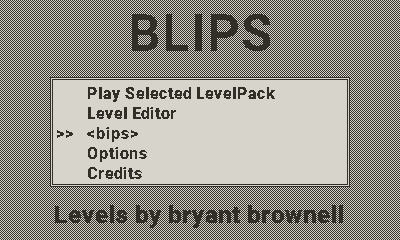
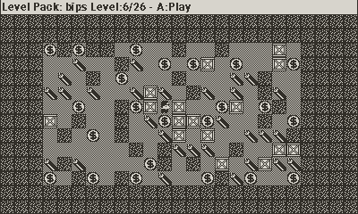
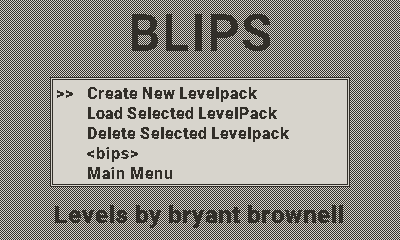

# Blips Playdate
   

Blips is a remake of the dos bips original, gold and platinum game made by Bryant Brownell, its a sokoban style puzzle game but with exploding dynamite, special boxes and collecting coins

## Screenshots





## Game Features:
- 26 Levels of original dos Bips game
- 18 Levels of original dos Bips Gold game
- 25 Levels of original dos Bips Platinum game
- Level Editor (Create your own Levels and Level Packs)
- Turn on/off sound & music
- Autosaves progress


## Controls

| Button | Action |
| ------ | ------ |
| A | Confirm in menus, level selector and questions asked, place a part in the level editor, Switch players if 2 players exists |
| B | Quit to title screen on the level selector, Quit to level selector in game and level editor mode. |
| DPAD | move main player |
| CRANK | Move in menus, At the level Selector inc/decrease selected level with 5. In the level editor select next/previous part |
| A + DPAD | When playing a level you can look around in the level freely if the level exceeds screen size|

## Playing the Game:
Blips Will start up at a main menu, here you can choose the level pack you wish to edit or play by using left and right when the level pack name is selected (it's between "<>" signs).
When a level pack is loaded either for game play or level editing, the level selector will show up. Here you select what level you wish to edit or play, if it has been unlocked yet.
After you solved a level one extra level will be unlocked. you always have to solve to last unlocked level in order to unlock the next one.
The aim of the game is to collect all the dollar coins in a level, you need to create pathways to these coins by pushing boxes around or even make them explode by pushing them into the dynamite

### Level Packs
If you wish to create levels yourself, load up the level editor and create a new level pack. You can choose a name for the levelpack by using up down left right and confirm the name by using A. 
Once a new level pack has been created you can then load it, and you will be in the level selector. 
just press A or select "Create Level" from the menu and start creating your own levels. The level editor will know when a level has been changed, so it will ask you, 
if you want to save whenever you quit back to the level selector. The level editor will also automatically choose a filename for the levels, you don't need to worry about this. 
Once your level pack is finished you can just zip your level pack directory or export it to bips ascii format and release it to the public. They will then have to unzip or place your (ascii) level pack in the level packs directory and it will be shown inside the game.

User made levels and packs are saved in the "levelpacks" folder from the games data folder. 

#### Level Packs Naming
Newly made levelpacks on the playdate are named `[name]._lev`, if you want to release this level pack for other people to play it, it is best that you rename the folder to just `[name]` leaving out `._lev` at the end.
This will make sure that users when they place your level pack in the levelpacks subfolder of the game's data folder can't delete it from within the game.

#### Deleting Level packs
You can only delete level packs that you created yourself using the build in delete level pack option, so basically levelpacks named `[name]._lev` as folder. if you edited levels for existing level packs it will only delete those modified or newly created levels.

#### Exporting to ASCII bip file format
You can export your levelpack to an ASCII bip file from within the leveleditor menu, it allows for easier sharing of your complete levelpacks and the game supports loading these from the levelpacks folder in the game's data folder.

#### ASCII bip file description
The bip level format is similar to the sok format for sokoban ascii levels as found on:
http://sokobano.de/en/levels.php and https://www.sourcecode.se/sokoban/levels.php

My parser does not follow 100% the sok format but it did work for the levels above in my sokoban sok format, and i've kept
the same parsing except for the levels itself as in my sokoban / playdoban game.

The parser does require levels to be fully surrounded by a wall, the lev binary format did not require this so make sure todo this in your levels

This is the Blips level set is defined with the following tile types:
```
Tile Legend:
  # - Wall (6) - immovable barrier
  @ - Player 1 (2) - 1st player
  & - Player 2 (8) - Optional 2nd player
  $ - Box (3) - boxes moveable by any player
  1 - Box Type 1 (9) - boxes only movable by player 1
  2 - Box Type 2 (10) - boxes only movable by player 2
  b - Box Bomb (11) - when pushed into anything else will make it explode except for walls and diamonds
  w - Box Wall (12) - movable box that looks like a wall and when 2 merge form a wall
  * - Bomb/Dynamite (5) - anything pushed into this explodes / dies and vanishes
  d - Diamond (7) - need to collect these
  x - Breakable Wall (13) - breakable by box bomb
    - Empty space - (it's a space)
```
	
## Credits
Game is a remake of dos bips, bips gold and bips platinum game made by Bryant Brownell and based on the gp2x version i initially made

### Level authors for Bips Levelpack
- Bryant Brownell
- Landon Brownell
- Caryn Brownell
- The PocoMan Team

### Music
- "title" Music was made by donskeeto

### Graphics
- dollar coin (adapted) - [kenney game assets all in 1](https://kenney.itch.io/kenney-game-assets) - [CC0 1.0 Universal](https://creativecommons.org/publicdomain/zero/1.0/)
- wall (adapted): [1001.com](https://opengameart.org/content/sokoban-pack) - [Attribution-ShareAlike 3.0 Unported](https://creativecommons.org/licenses/by-sa/3.0/)
- floor (adapted): [Kenney Sokoban tiles](https://opengameart.org/content/sokoban-100-tiles) - [CC0 1.0 Universal](https://creativecommons.org/publicdomain/zero/1.0/)
- player (adapted): [Kenney Sokoban tiles](https://opengameart.org/content/sokoban-100-tiles) - [CC0 1.0 Universal](https://creativecommons.org/publicdomain/zero/1.0/)
- box (adapted): [SpriteAttack boxes and crates](https://opengameart.org/content/boxes-and-crates-svg-and-pngs) - [CC0 1.0 Universal](https://creativecommons.org/publicdomain/zero/1.0/)
- dynamite (adapted): [GUI Icons by Rexard](https://www.gamedevmarket.net/asset/gui-icons-8656) - I Payed for this asset do not reuse !

### Sound
- "stageend" by Fupi - CC0 1.0 Universal - https://opengameart.org/content/win-jingle
- "select" - created by ViRiX Dreamcore (David McKee) soundcloud.com/virix - Attribution 3.0 Unported - https://opengameart.org/content/ui-and-item-sounds-sample-1
- "back" - created by ViRiX Dreamcore (David McKee) soundcloud.com/virix - Attribution 3.0 Unported - https://opengameart.org/content/ui-and-item-sounds-sample-1
- "error" - created by ViRiX Dreamcore (David McKee) soundcloud.com/virix - Attribution 3.0 Unported - https://opengameart.org/content/ui-failed-or-error
- "menu" - created by Tim Mortimer - Attribution 3.0 Unported -  https://opengameart.org/content/4-sci-fi-menu-sounds
- "move" - created by me (willems davy) using BXFR - feel free to use
